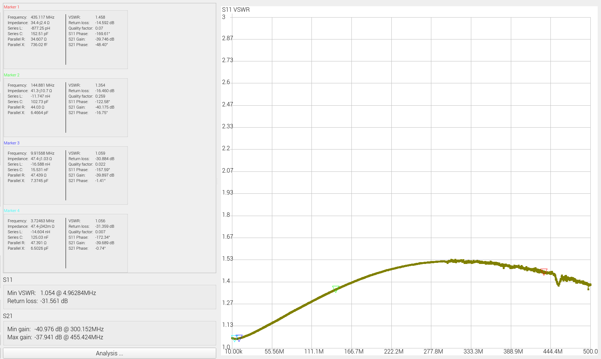
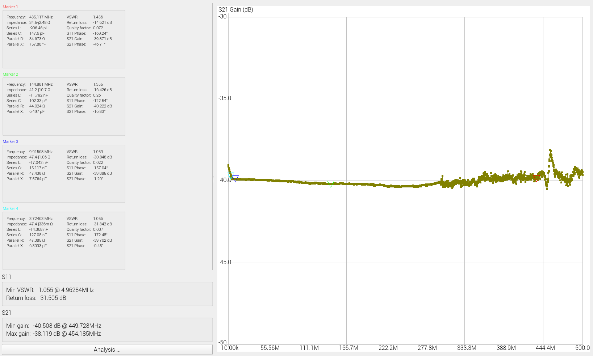

# RF Power Measurement Rig 

## Introduction

The main objective of this article was to utilize capabilities provided by Raspberry Pi Zero platform and its extensive HAT (hardware attached on top) ecosystem to modernize inital RF power meter design published by Wes Hayward W7ZOI and Bob Larkin W7PUA in June 2001 QST Magazine [1]. Similar work has been done in the past by Roger Hayward, KA7EXM [2], Reinhardt Weber, DC5ZM [3] and most recetly by Mirek Sadowski SP5GNI [4], but all earlier modernizations were based on either PIC microcontrollers or Arduino Nano platform leaving Raspberry Pi gang empty handed.

The core component of all power meters mentioned above is Analog Devices AD83xx logarithmic amplifier. which converts the power level of measured signal to a voltage.
AD83xx log amp transfer function describing relation between input power level in dBms and coresponding output voltage in Volts is highly linear and can be expressed as 

$Pinput [dBm] = a * Uout [V] + b$

where $a$ and $b$ are respectively linear curve slope and intercept coeffiients [5]. 
 
AD8307 [6] used in this implementation, accepts input signal frequencies from DC to 500 MHz and input signal levels from -95dBm to +17dBm. 
Readily available AD8307 detector board purchased at Amazon is used for this project (see below)

Since presented device is intended to be used to measure output power of the typical ham radio transceivers, the input signal level accepted by the power meter must be  extended to 100 Watts or 50 dBms. This is done by the use of -40dB RF Tap/Attenuator (see below). 

 

Resistors R1a, R1b and R1c shall be 500mW rated. R2 can be 125mW rated. Please note that if you do not terminate RF path with 50ohm dummy load or antenna, power (Prms) dissipated on one of R1 resistors goes up to 1.3W!

To minimize attenuation increase for frequencies aboth 144MHz capacitor made of wire connected parallel to R1a shall be added.  

RF Tap VSWR and Attenuation curves are shown below:

 

Power Monitor HAT based on Texas Instruments Ina219 chips [7] and manufactured by SB Components [8] is used to perform analog to digital conversion of the AD8307 output signal (see below).

 

This particular HAT offers four 12-bit ADC channels, which can be handy if SWR measurements are considered in the future. Ina219 chips are controlled by Pi Zero using I2C data bus.

AD83xx output voltage level, decreases with the frequency of measured signal even though input signal power level is kept constant. This effect can be compensated with simple two point calibration procedure [5] performed separately for each ham band. Calculated coeficient pairs are then incorporated into Python measurement script executing on Pi Zero. Band selection is made by use of up/down buttons on meters front pannel.

To present measurement results Mini PiTFT 1,3'' 240x240px ST7780 based display HAT [9] from AdaFruit is used (see below). 

 

Display module is controlled by Pi Zero using SPI bus. PiTFT HAT is also equipped with two tact switches, which are used in this project as Up/Down band selectors.

During power measurements antenna is replaced by dummy load based on inductance-less RFP-250 resistor manufactured by Anaren (or similar such as RFR 50-250).
To allow for sufficient heat disipation resistor has been enclosed in aluminium Hammond box (model: 1590LLB) attached to heat sink (see below).

 

## Power Meter - Software Architecture

Key building blocks of power meter software include three systemd services written in python. Interaction between those services, operating system and the user are depicted on the below flow diagram:

Brief description of each power meter service can be found below:

### Display Handler

Display Handler service (display-handler.service/display-handler.py) provides power meter graphical interface and implements band selector function.

Band selector function is based on two tact switches available on PiTFT display HAT. Display handler continously reads power data from the powermeas.value text file stored in measurement loop service directory and displays it on TFT screen. It also continously checks if one of the up/down tact switches have been pressed and based on this information calculates currently selected measurement band. Latest selected band information is stored in bandselector.value text file located in display handler service directory.

Display Handler service utilizes the following Circuit Python modules:
board - SPI bus support
digitalio - tact switches status handling (including switch debouncing function)
adafruit_rgb_display - support for ST7780 TFT display controller

Display Handler also uses Python Imaging Library (PIL) to implement graphical operations such as font handling and drawing. 

### Measurement Loop

Measurement loop service (measurement-loop.service/measurement-loop.py) continously measure the input power level in dBm and Watts.

Measurement loop service (measurement-loop.service/measurement-loop.py) continously reads AD8307 output voltage over I2C interface of Ina219 12-bit ADC. It also continously reads selected measurement band stored in file bandselector.value located in display handler service directory. Based on selected band the appropriate voltage to power conversion function is used to calculate power value in dBm, which coresponds to measured output voltage of AD8307. Additionally power level in dBm is converted to its equivalent in Watts. Both power values are stored in powermeas.value text file located in measurement loop service directory.

Measurement loop service utilizes the following Circuit Python modules:
board - I2C bus support
adafruit_ina219 - ina219 ADC support

### Power Management 

Power Management service (power-management.service/power-management.py) controls status LED and ensures clean halt/power-off of Pi Zero platform.

When Pi platform is woken-up from halt or powered on, power management service starts and switches status LED from tracking CPU activity (default set in /boot/config.txt) to the continous on state. This prevents LED from periodic blinking while measurement loop is running. It also changes GPIO26 output level from default High to Low, which disconnects GPIO3 from on/off buton preventing possible interuption of data flow on I2C bus when on/off button is pressed and at the same time enabling Vcc powering AD8307 sensor.

Power measurement service then continously monitors the state of halt button connected to GPIO3 line. As soon as halt button is pressed for at least 3 seconds the power management service switches status LED back to tracking CPU activity and sends halt signal to the operating system, which puts Pi Zero into sleep.

When Pi Zero is in sleep mode GPIO26 state is high, which connects GPIO3 to on/off button allowing Pi to respond to wake-up trigger. GPIO26 high state also cuts Vcc from AD8307 sensor.  

This is critical functionality which ensures clean halt of Pi Zero platform providing protection against SSD data card corruption, which is likely to occur when Pi is shut down in uncotrolled manner. It also prevents measurement results from being corrupted by on/off button presses, which could cause data flow interuption on I2C bus.

Power Management service utilise the following Python mondules:
RPi - GPIO support

## Calibration Procedure

....

Calibrated system provides +/- 2 Watt accuracy within 0 - 100 Watt range of measured power and frequencies covering all HF ham bands.

## Measurement Setup

## References

[1] [Simple RF-Power Measurement, Wes Hayward, W7ZOI, Bob Larkin, W7PUA - June 2001 QST]
[2] [A PIC-based HF/VHF Power Meter, Roger Hayward, KA7EXM - May/June 2005 QEX and the June 2005 QST]
[3] [Digital Power Meter, Reinhardt Weber, DC5ZM - FUNKAMATEUR (1/2018 page. 38) (in German) or at] (https://www.dl2mdu.de/rf-power-level-meter/) (english transcript) 
[4] [Miernik Poziomu Sygnału RF z AD8318, Mirek Sadowski, SP5GNI -] (https://hf5l.pl/miernik-poziomu-sygnalu-z-ad8318/) (in Polish)
[5] Obscurities & Applications of RF Power Detectors, Carlos Calvo, Analog Devices 2007
[6] AD8307 Data Sheet, Analog Devices
[7] Ina219 Zerø-Drift, Bi-Directional CURRENT/POWER MONITOR with I2C™ Interface, Texas Instruments
[8] Power Monitor Hat Product Page, SB Components - https://shop.sb-components.co.uk/blogs/posts/how-to-use-power-monitor-hat 
[9] Mini PiTFT 1,3'' Display Product Page, Adafruit - https://www.adafruit.com/product/4484
[10]